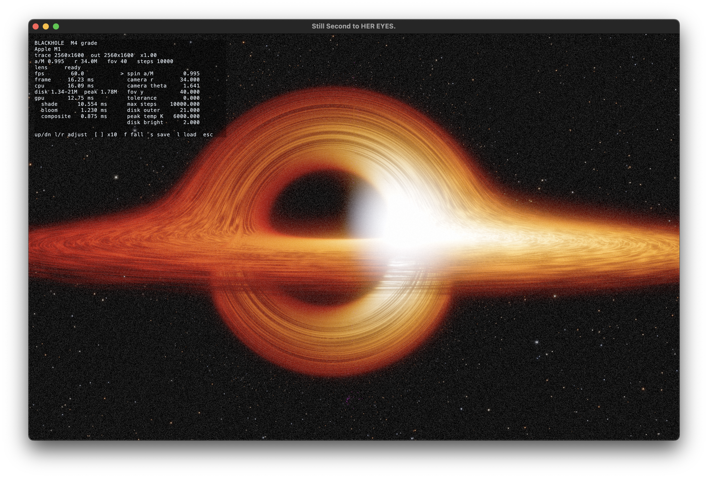

# Gargantua: Real-Time Kerr Black Hole Renderer



A real-time Kerr black hole ray tracer built for Apple Silicon in C++23 and native Metal. 

Most black hole visualizers take cinematic shortcuts. They turn down Doppler beaming so the image stays symmetrical. They throw away the ergosphere or ignore relativistic aberration so audiences do not get dizzy. 

This engine does the opposite. We wanted the raw physics of general relativity running at full display resolution at 60 fps on an M1 Air. It lets you pilot around a rapidly spinning Kerr black hole, inspect the sheared accretion disk, and drop straight through the gas into the event horizon.

## Architecture

General relativity is expensive. Integrating null geodesics across millions of screen pixels will bring any mobile GPU to its knees if done carelessly. 

The core breakthrough here is separating spacetime geometry from shading. For a static camera in a stationary spacetime, the mapping from pixel space to celestial coordinates does not depend on time. We solve the geodesics once into a multi-layer lens buffer using a high-order Dormand-Prince integrator. 

```
  Camera Changes                     Every Frame (60 FPS)
  [ Lens Build Pass ]          --->  [ Shade Compute Pass ]  --->  [ Bloom ]  --->  [ AgX Composite ]
  DOPRI5(4) Geodesics                Volumetric Disk Gas           Down/Up Chain       Display EOTF
  Adaptive Step Control              Relativistic Doppler          Karis Filter        Monospace HUD
```

Each frame after that simply samples the cached lens map. The shade pass evaluates disk turbulence, blackbody radiation, and relativistic beaming in under 15 milliseconds. When you engage free fall, the engine switches gears: it rebuilds the lens map dynamically every frame at dynamic resolution, keeping the framerate locked while spacetime distorts around you.

## The Physics

The engine integrates null and timelike geodesics in Boyer-Lindquist coordinates with zero compromises.

Spacetime geometry uses the full Kerr metric with frame dragging. The observer sits inside a Zero Angular Momentum Observer (ZAMO) orthonormal tetrad. Any observer velocity applies a Lorentz boost to the camera ray bundle, producing true relativistic aberration and beaming.

Light rays integrate Hamiltonian equations of motion using canonical momentum coordinates `p_r` and `p_theta`. Working directly in momentum space prevents coordinate singularities at radial turning points and handles photon-sphere orbits cleanly. Between steps, the integrator projects state back onto the separated Carter constants to kill secular numerical drift.

The accretion disk is modeled as a physical slab of gas rather than a paper-thin polygon. Rays integrate optical depth and density across continuous crossings through a Gaussian vertical profile. Gas radiates according to the Page-Thorne thin-disk model with a zero-torque inner boundary at the innermost stable circular orbit (ISCO). Emitted temperatures feed into a calibrated Planckian locus lookup table, reproducing realistic blackbody color temperatures from dull infrared crimson to blazing blue-white.

Free fall follows timelike geodesics computed with double precision. Pressing `F` releases the camera from rest, sending it on an orbital spiral through the accretion disk. Relativistic aberration bends the visual field into a forward cone as inward velocity approaches the speed of light.

## Building and Running

The project requires macOS running on Apple Silicon, CMake 3.25+, and the Xcode command line tools.

```bash
cmake -B build -DCMAKE_BUILD_TYPE=Release
cmake --build build -j
./build/blackhole
```

The build fetches SDL3 and Apple's `metal-cpp` headers automatically. Shaders compile directly to Metal Intermediate Representation (`.air`) and pack into a native Metal library with source recording enabled for the Xcode GPU Profiler.

### Acceptance Suite

To verify that mathematical invariants hold, the binary includes an analytical test suite:

```bash
./build/blackhole --validate
```

This verifies 55 distinct relativistic invariants against closed-form solutions: shadow asymmetry from frame dragging, photon sphere radii, ISCO locations across spin values, weak-field light deflection angles, and energy conservation during free fall.

## Controls

The simulator provides an on-screen heads-up display showing live GPU timers and simulation parameters.

| Key | Action |
| --- | --- |
| `Up` / `Down` | Select tunable parameter |
| `Left` / `Right` | Adjust selected value |
| `[` / `]` | Coarse adjustment (10x step) |
| `F` | Toggle timelike geodesic free fall |
| `D` | Cycle diagnostic false-color views |
| `S` / `L` | Save / reload parameter preset to disk |
| `Escape` | Reset camera or exit |

You can also override parameters from the command line:

```bash
./build/blackhole --fall
./build/blackhole --screenshot capture.ppm --time 30 --set "spin a/M=0.99"
./build/blackhole --fall-tau 146 --screenshot horizon_descent.ppm
```

Diagnostic modes (`D`) expose internal pipeline buffers: disk column density, relativistic Doppler shift factors, crossing counts, raw Perlin turbulence, and footprint Nyquist bounds.
